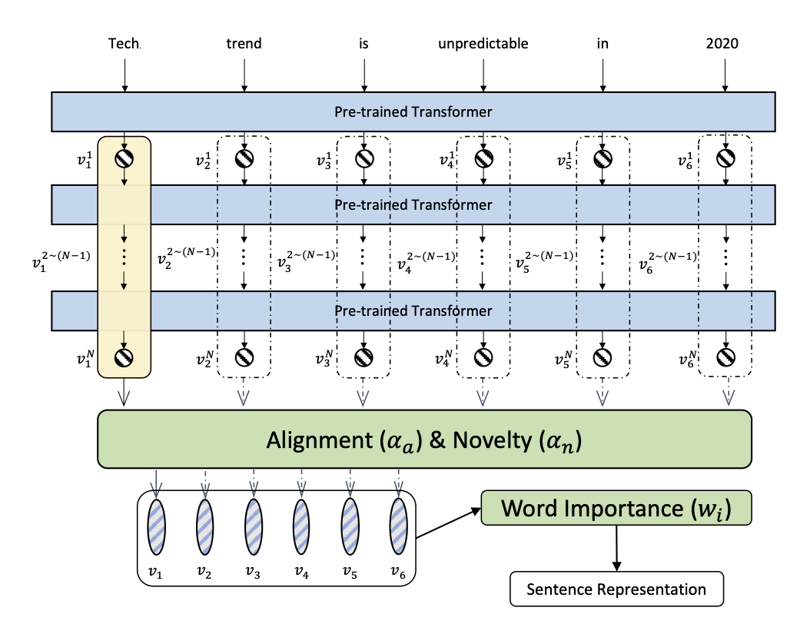

# SBERT-WK: A Sentence Embedding Method By Dissecting BERT-based Word Models


Pre-trained language models are quite powerful in a wide range of NLP tasks. But current models mostly provide word/token level representations. How to obtain good sentence representation from deep contextualized models remains challenging. Previous approaches includes averaging token representations or use CLS tokens provides rather poor performance in either textual similarity tasks, clustering and supervised tasks. In this work, we provide a new approach in finding sentence representations by dissecting deep contextualized models. Through geometric analysis, our model is capable in finding salient components in representation arocss layers and unified token representations. We evaluate our approach on a wide range of tasks and showed its effectiveness.

Note that our model is not focus on further tuning with sentence objective. But find ways to merge the learned token representation across layers and compute sentence embedding with better quality.

Details of our method can be found in our publication: [SBERT-WK]() The code and pretrained model can also be find here: [code](https://drive.google.com/drive/folders/1ldbNo1paTYHo8wbtfwII-DvXTD6rFSfr?usp=sharing), [pre_trained model](https://drive.google.com/open?id=1zRqluT2-R0VywWKE-HzMK2sOP3sNPhtY)

## Setup
We are using Python 3.7 and the model is implemented with Pytorch 1.3.

For backbone models: we use 
[transformers v2.2.2](https://github.com/huggingface/transformers)

```
    conda create -n SBERT-WK python=3.7
    conda install numpy
    conda install pytorch=1.3 torchvision cudatoolkit=10.1 -c pytorch
    pip install transformers==2.2.2
    conda install -c anaconda scikit-learn
```

## Get Started to Duplicate the result from the Paper

**First**, clone our code.

**Second**, download [SentEval](https://github.com/facebookresearch/SentEval) and put it in the folder and rename it 
```
    ./SBERT-WK-Sentence-Embedding-master/SentEval
```
Download data for STS and downstream tasks
```
    ./SBERT-WK-Sentence-Embedding-master/SentEval/data/downstream/get_transfer_data.bash
```

**Third**, run our bash file to reproduce the result.
```
    python SBERT_WK.py \
        --model_type 'binwang/bert-base-nli' \
        --embed_method 'dissecting'  \
        --max_seq_length 128 \
        --batch_size 64 \
        --context_window_size 2 \
        --tasks 'sts' \
```
We have shared 7 models from the https://huggingface.co/models. All the models can be easily accessed by changing the model_type in the above command.
```
    --model_type 'binwang/bert-base-uncased'    # Original BERT Model                        (12 layers)
    --model_type 'binwang/roberta-base'         # Original RoBERTa Model                     (12 layers)
    --model_type 'binwang/xlnet-base-cased'     # Original XLNET Model                       (12 layers)
    --model_type 'binwang/bert-base-nli' #      # BERT Model finetuned on NLI data           (12 layers)
    --model_type 'binwang/bert-base-nli-stsb'   # BERT Model finetuned on NLI and STSB data  (12 layers)
    --model_type 'binwang/bert-large-nli'       # Large BERT finetuned on NLI data           (24 layers)
    --model_type 'binwang/bert-large-nli-stsb'  # Large BERT finetuned on NLI and STSB data  (24 layers)
```
The way to obtain the sentence embedding from the deep contextualized model can be two ways:
```
    --embed_method 'dissecting'
    --embed_method 'ave_last_hidden'
```
Choose tasks to evaluate on:
```
    --tasks 'sts'
    --tasks 'supervised'
    --tasks 'probing'
    --tasks 'all'
```

## Performance on STS tasks (Pearson)

|    Model        | STS12 | STS13 | STS14 | STS15 | STS16 | STS-B | SICK-R |
|-----------------|-------|-------|-------|-------|-------|-------|--------| 
| Avg. GloVe      | 52.22 | 49.60 | 54.60 | 56.26 | 51.41 | 64.79 | 79.92  | 
| InferSent       | 59.33 | 58.85 | 69.57 | 71.26 | 71.46 | 75.74 | 88.35  |
| USE             | 61.00 | 64.00 | 71.00 | 74.00 | 74.00 | 78.00 | 86.00  |
| BERT - CLS      | 27.58 | 22.52 | 25.63 | 32.11 | 42.69 | 52.14 | 70.05  |
| Avg. BERT       | 46.87 | 52.77 | 57.15 | 63.47 | 64.51 | 65.22 | 80.54  |
| Sen-BERT (base-nli)| 64.61 | 67.54 | 73.22 | 74.34 | 70.13 | 74.09 | 84.23  |

|    **SBERT-WK**    | STS12 | STS13 | STS14 | STS15 | STS16 | STS-B | SICK-R |
|--------------------|-------|-------|-------|-------|-------|-------|--------| 
| bert-base-uncased  |
| bert-base-nli      | 70.22 | 68.13 | 75.46 | 76.94 | 74.51 | 80.00 | 87.38  |
| bert-base-nli-stsb |
| bert-large-nli     |
| bert-large-nli-stsb|


## Citing and Authors
If you find our model is useful in your research, please consider cite our paper: [SBERT-WK: A Sentence Embedding Method By Dissecting BERT-based Word Models](https://arxiv.org/abs/xx.xx):

``` 
@inproceedings{xxx,
    title = "SBERT-WK: A Sentence Embedding Method By Dissecting BERT-based Word Models",
    author = "xxx",
    booktitle = "xx",
}
```

Contact person: Bin Wang, bwang28c@gmail.com

http://mcl.usc.edu/


## Acknowledge

Many thanks for [Transformer repo](https://github.com/huggingface/transformers) and [Sentence-BERT repo](https://github.com/UKPLab/sentence-transformers) in providing pretained models and easy to use architecture.
Thanks for SentEval for evlaluation toolkit. [SentEval](https://github.com/facebookresearch/SentEval)
